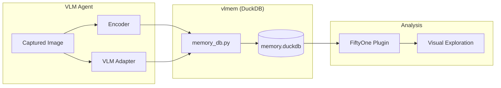

# 👁️ vlmem

**A FiftyOne + DuckDB Integration for Multimodal Memory**

**vlmem** is a specialized plugin designed to provide VLM (Vision-Language Model) agents with persistent, searchable visual historical context. By combining the powerful visual exploration of **FiftyOne** with the rapid, vector-capable storage of **DuckDB**, this system allows agents to "remember" past visual experiences and retrieve them across different sessions.

---

## 🚀 Key Features

- **Long-term Visual Context:** Store visual embeddings, VLM-generated descriptions, and metadata across agent sessions.
- **Fast Vector Search:** Leverages DuckDB's `vss` extension for sub-second brute-force cosine similarity searches on 512-dimensional CLIP vectors.
- **FiftyOne Integration:** Easily export memories to Parquet for instant visualization and analysis in FiftyOne.
- **Upsert Capability:** Automatically updates memory records for the same sample ID to prevent duplication.
- **Session-aware Tracking:** Filter or clear memories based on specific `session_id` tags.

## 🏗️ Architecture



## 🛠️ Components

1.  **`memory_db.py`**: The core database engine using DuckDB. Handles all writes, similarity searches, and Parquet exports for FiftyOne.
2.  **`encoder.py`**: (Work in progress) Encodes images into vector embeddings.
3.  **`vlm_adapter.py`**: (Work in progress) Interfaces with VLMs (e.g., Gemini 2.5) to generate rich text descriptions of visual samples.
4.  **`seed.py`**: Pre-populates the database with demo memories from FiftyOne's dataset zoo.

## 🏁 Getting Started

### 1. Environment Setup
```bash
python3.13 -m venv venv
source venv/bin/activate
pip install -r requirements.txt  # Or manually install duckdb, fiftyone, etc.
```

### 2. Basic Usage
```python
from memory_db import VisualMemoryDB
import numpy as np

# Initialize
db = VisualMemoryDB("memory.duckdb")

# Store a memory
db.write(
    sample_id="obs_001",
    filepath="/path/to/image.jpg",
    embedding=np.random.rand(512), 
    description="A robot arm picking up a red cube",
    tags=["robotics", "red_cube"],
    session_id="session_A"
)

# Search past memories
results = db.search(query_embedding, k=3)
print(f"Top Match: {results[0]['description']} (Score: {results[0]['similarity']})")
```

---

---

## 👥 Authors

- **Ralph Andrade**: Core DuckDB Memory Engine, Table Schema, and Parquet Integration.
- **Priyank Patel**: VLM Adapter & CLIP Encoder Logic.
- **Younjoo Han**: FiftyOne Plugin Exploration & Deployment.
- **Jason Nitz**: Dataset curation and Exploration.

*This project was built for the VLM Memory Hackathon.*
